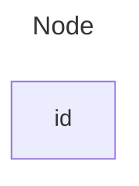
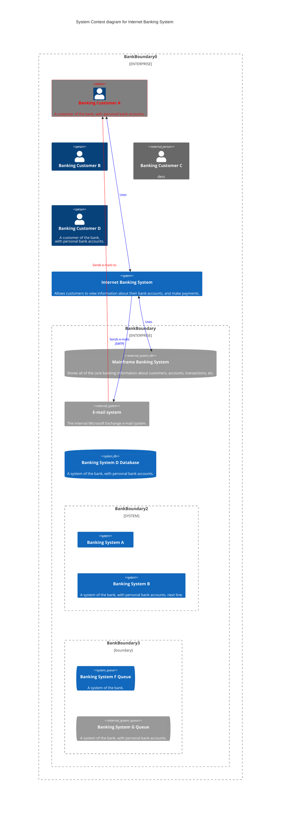

# Mermaid

Mermaid 是一个基于 JavaScript 的图表绘制工具，可渲染 Markdown 启发的文本定义以动态创建和修改图表。

使用 Mermaid 可以让你的博客更加美观和生动。

关于 Mermaid 语法的详细内容，请查看[官方文档](https://mermaid.nodejs.cn/intro/)。

你也可以使用[官方的编辑器](https://mermaid-live.nodejs.cn/edit)绘制图表，然后把代码复制到博客中。

## 如何开启

[参考文章](https://zshellman.github.io/2019-06-10-Github-pages-%E5%A2%9E%E5%8A%A0mermaid%E8%AF%AD%E6%B3%95%E6%94%AF%E6%8C%81/)

*很遗憾，按照上文的方法似乎并不能在浏览器上正确渲染 Mermaid 图表，我会将这个问题添加到个人代办事项中，并在之后寻找解决办法*

## 示例

下面是第一个示例，用于测试 Mermaid 图表在 GFM 渲染器渲染的 GitHub Pages 博客中能否正确绘制：

下面是第二个示例，用于测试 Mermaid 最新的 C4 图能否被正确渲染：

